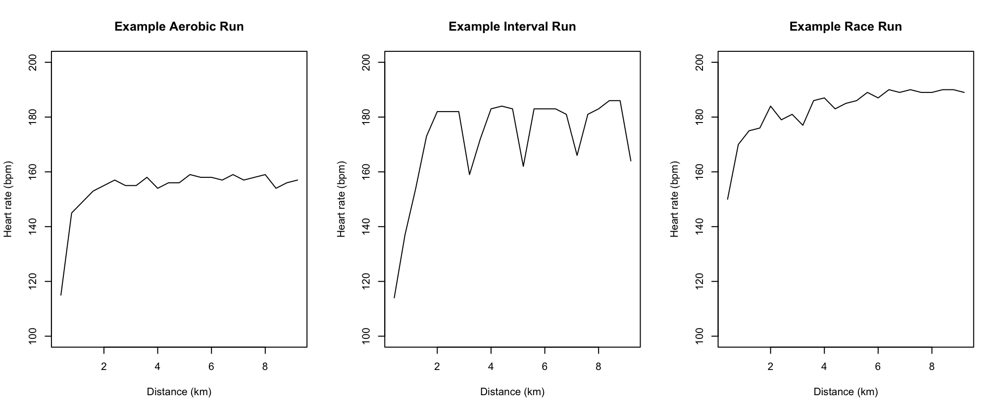
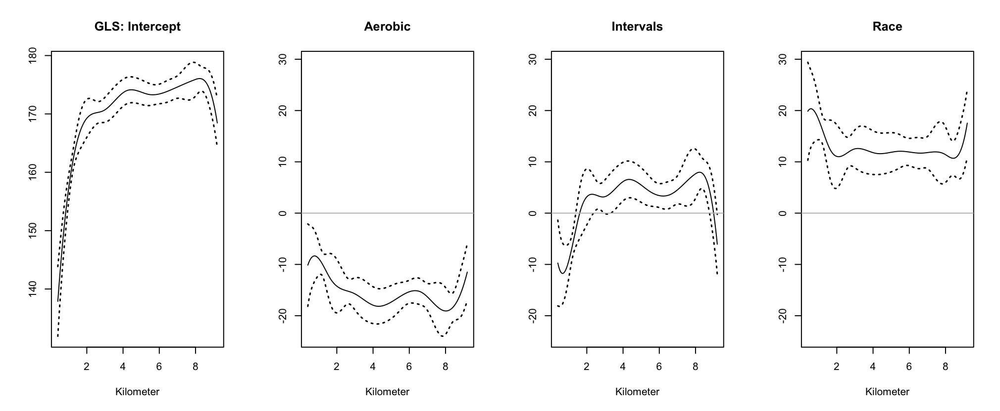
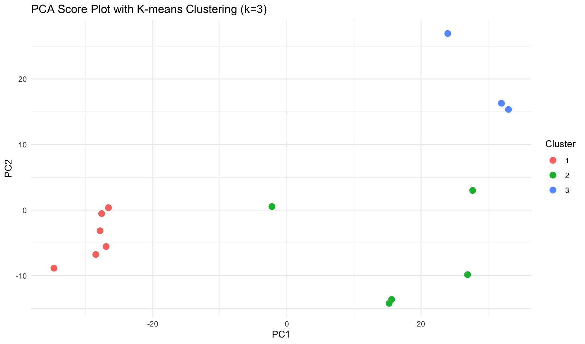

# Heart Rate Patterns Across Running Workouts

**Functional Data Analysis in R | Sports Analytics**

**Methods:** B-spline smoothing · Function-on-Scalar Regression · Functional PCA · K-means clustering

## Overview

This project explores how heart-rate trajectories differ across **aerobic runs, interval workouts, and race efforts**. Rather than summarizing each workout with a single average heart rate, I used Functional Data Analysis (FDA) to study how effort changes throughout a run.

This was an independent project for a Functional Data Analysis course.

## Data

I analyzed **14 personal running workouts** recorded with a Garmin watch and heart-rate chest strap: **6 aerobic, 5 interval, and 3 race runs**. Each run covered 9.2 km. Heart-rate readings were averaged within consecutive 400 m segments, yielding **23 observations per workout**.



## Methodology

- **Functional smoothing:** Represented the heart-rate measurements as smooth curves using cubic B-splines.
- **Function-on-Scalar Regression:** Used generalized least squares to estimate the average heart-rate trajectory and how it differs by workout type.
- **Functional Principal Component Analysis (FPCA):** Summarized variation in curve shape using four principal components and varimax rotation.
- **Unsupervised clustering:** Applied K-means (*k* = 3) to the functional PCA scores and reconstructed representative curves for the resulting clusters.

## Results

- **Workout types showed distinct patterns:** Aerobic runs generally had lower, steadier heart rates; interval sessions showed fluctuations in effort; and race efforts tended to sustain higher heart rates.
- **Four functional principal components accounted for approximately 99% of the observed variation** in the analyzed curves.
- **K-means produced three clusters that broadly corresponded to the recorded workout types.** Interval runs showed greater variability, suggesting that differences in interval timing may affect the comparison.

**Run-type effects from functional regression**



**Clustering of functional principal component scores**



[View reconstructed heart-rate curves for the three clusters](figures/cluster-heart-rate-profiles.png).

## How to Run

The analysis was written in **R** using `fda`, `refund`, and `ggplot2`.

```r
install.packages(c("fda", "refund", "ggplot2"))
source("run_analysis.R")
```

The original `Diff_runs.txt` dataset is **not included** in this public version. To reproduce the analysis, first place an appropriately formatted dataset in `data/Diff_runs.txt` (see [`data/README.md`](data/README.md)) and run the script from the repository root.

## Limitations and Future Work

This is an exploratory analysis of **14 workouts from one runner**, not a validated workout-classification system. K-means clusters were compared with the known workout types on the same data, and no out-of-sample classification accuracy was measured. Future work could include more workouts and functional registration to better align the high-intensity segments of interval runs.

**Author:** Wendy Garcia Umbarita
